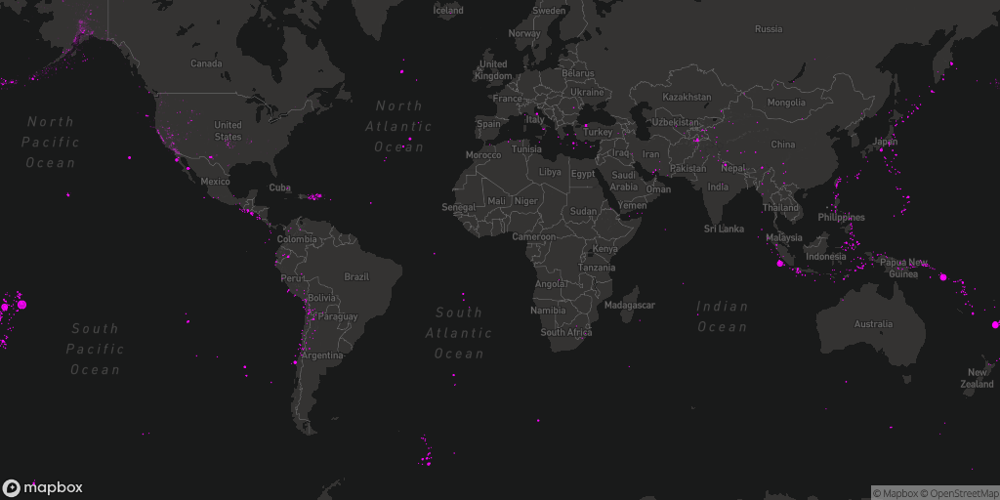

Visualizing Data: Mapping Earthquakes with p5 library with using java script. This is only educational purposes to learn java script and try to do project instead of visualizing map with java8 eclipse project with UnfoldingMaps.

<!-- Improved compatibility of back to top link: See: https://github.com/othneildrew/Best-README-Template/pull/73 -->

<!--
*** Thanks for checking out the Best-README-Template. If you have a suggestion
*** that would make this better, please fork the repo and create a pull request
*** or simply open an issue with the tag "enhancement".
*** Don't forget to give the project a star!
*** Thanks again! Now go create something AMAZING! :D
-->

<!-- PROJECT SHIELDS -->
<!--
*** I'm using markdown "reference style" links for readability.
*** Reference links are enclosed in brackets [ ] instead of parentheses ( ).
*** See the bottom of this document for the declaration of the reference variables
*** for contributors-url, forks-url, etc. This is an optional, concise syntax you may use.
*** https://www.markdownguide.org/basic-syntax/#reference-style-links
-->
[![Contributors][contributors-shield]][contributors-url]
[![Forks][forks-shield]][forks-url]
[![Stargazers][stars-shield]][stars-url]
[![Issues][issues-shield]][issues-url]
[![MIT License][license-shield]][license-url]
[![LinkedIn][linkedin-shield]][linkedin-url]

<!-- PROJECT LOGO -->
 

  

  <h3 align="center">Earth Quake Project with Java Script</h3>

  

     
    <a href="https://github.com/makifyegin/eartquake/issues">Report Bug</a>
  

<!-- CONTACT -->
## Contact

Project Link: [https://github.com/makifyegin/eartquake](https://github.com/makifyegin/eartquake)

(<a href="#readme-top">back to top</a>)

<!-- ACKNOWLEDGMENTS -->
## Acknowledgments

Use this space to list resources you find helpful and would like to give credit to. I've included a few of my favorites to kick things off!

* [Choose an Open Source License](https://choosealicense.com)
* [GitHub Emoji Cheat Sheet](https://www.webpagefx.com/tools/emoji-cheat-sheet)
* [Malven's Flexbox Cheatsheet](https://flexbox.malven.co/)
* [Malven's Grid Cheatsheet](https://grid.malven.co/)
* [Img Shields](https://shields.io)
* [GitHub Pages](https://pages.github.com)
* [Font Awesome](https://fontawesome.com)
* [React Icons](https://react-icons.github.io/react-icons/search)

(<a href="#readme-top">back to top</a>)

<!-- MARKDOWN LINKS & IMAGES -->
<!-- https://www.markdownguide.org/basic-syntax/#reference-style-links -->
[contributors-shield]: https://img.shields.io/github/contributors/makifyegin/eartquake.svg?style=for-the-badge
[contributors-url]: https://github.com/makifyegin/eartquake/graphs/contributors
[forks-shield]: https://img.shields.io/github/forks/makifyegin/eartquake.svg?style=for-the-badge
[forks-url]: https://github.com/makifyegin/eartquake/network/members
[stars-shield]: https://img.shields.io/github/stars/makifyegin/eartquake.svg?style=for-the-badge
[stars-url]: https://github.com/makifyegin/eartquake/stargazers
[issues-shield]: https://img.shields.io/github/issues/makifyegin/eartquake.svg?style=for-the-badge
[issues-url]: https://github.com/makifyegin/eartquake/issues
[license-shield]: https://img.shields.io/github/license/makifyegin/eartquake.svg?style=for-the-badge
[license-url]: https://github.com/makifyegin/eartquake/blob/master/LICENSE.md
[linkedin-shield]: https://img.shields.io/badge/-LinkedIn-black.svg?style=for-the-badge&logo=linkedin&colorB=555
[linkedin-url]: https://linkedin.com/in/makifyegin
[product-screenshot]: images/screenshot.png

[Next.js]: https://img.shields.io/badge/javascript-%23323330.svg?style=for-the-badge&logo=javascript&logoColor=%23F7DF1E
[Next-url]: https://nextjs.org/makifyegin

[React.js]: https://img.shields.io/badge/html5-%23E34F26.svg?style=for-the-badge&logo=html5&logoColor=white
[React-url]: https://reactjs.org/
[Vue.js]: https://img.shields.io/badge/css3-%231572B6.svg?style=for-the-badge&logo=css3&logoColor=white
[Vue-url]: https://vuejs.org/

[Angular.io]: https://img.shields.io/badge/p5.js-ED225D?style=for-the-badge&logo=p5.js&logoColor=FFFFFF

[Angular-url]: https://angular.io/

[Svelte.dev]: https://img.shields.io/badge/Visual%20Studio%20Code-0078d7.svg?style=for-the-badge&logo=visual-studio-code&logoColor=white
[Svelte-url]: https://svelte.dev/

[Laravel.com]: https://img.shields.io/badge/Postman-FF6C37?style=for-the-badge&logo=postman&logoColor=white
[Laravel-url]: https://laravel.com
[Bootstrap.com]: https://img.shields.io/badge/Linux-FCC624?style=for-the-badge&logo=linux&logoColor=black
[Bootstrap-url]: https://getbootstrap.com

[JQuery.com]: https://img.shields.io/badge/Google%20Chrome-4285F4?style=for-the-badge&logo=GoogleChrome&logoColor=white
[JQuery-url]: https://jquery.com

### Built With

This section should list any major frameworks/libraries used to selenium my project.

* [![Next][Next.js]][Next-url]
* [![React][React.js]][React-url]
* [![Vue][Vue.js]][Vue-url]
* [![Angular][Angular.io]][Angular-url]
* [![Svelte][Svelte.dev]][Svelte-url]
* [![Laravel][Laravel.com]][Laravel-url]
* [![Bootstrap][Bootstrap.com]][Bootstrap-url]
* [![JQuery][JQuery.com]][JQuery-url]

(<a href="#readme-top">back to top</a>)

<!-- MARKDOWN LINKS & IMAGES -->
<!-- https://www.markdownguide.org/basic-syntax/#reference-style-links -->
[contributors-shield]: https://img.shields.io/github/contributors/makifyegin/eartquake.svg?style=for-the-badge
[contributors-url]: https://github.com/makifyegin/eartquake/graphs/contributors
[forks-shield]: https://img.shields.io/github/forks/makifyegin/eartquake.svg?style=for-the-badge
[forks-url]: https://github.com/makifyegin/eartquake/network/members
[stars-shield]: https://img.shields.io/github/stars/makifyegin/eartquake.svg?style=for-the-badge
[stars-url]: https://github.com/makifyegin/eartquake/stargazers
[issues-shield]: https://img.shields.io/github/issues/makifyegin/eartquake.svg?style=for-the-badge
[issues-url]: https://github.com/makifyegin/eartquake/issues
[license-shield]: https://img.shields.io/github/license/makifyegin/eartquake.svg?style=for-the-badge
[license-url]: https://github.com/makifyegin/eartquake/blob/master/LICENSE.txt
[linkedin-shield]: https://img.shields.io/badge/-LinkedIn-black.svg?style=for-the-badge&logo=linkedin&colorB=555
[linkedin-url]: https://linkedin.com/in/othneiw
[product-screenshot]: images/screenshot.png
